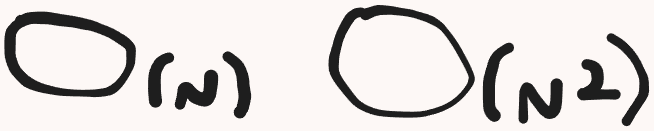
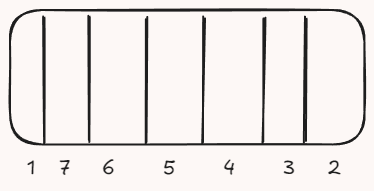

We are going to begin with the Big O Notation.

# Importance

It's important to learn and understand about Big O, since is usually asked in interviews. Besides, understanding Big O
can lead us to make better algorithms.

# What it is?

Big O is a form to denote (give an ideia) about the algorithm performance, **but it is not necessarily a way to measure
the algorithm performance.**

The Big O is going to tell us how this algorithm is going to escalate according to the input size.

Let's imagine that we have two algorithms: one is ``O(n)`` the other is ``O(n²)``. We can't confirm that one is faster
than the other without making a deep analysis. **This analysis is named: synoptic analysis.**

In theory, ``O(n)`` is better than ``O(n²)``. But without the synoptic analysis, we can't confirm witch one is going to
perform better.

But we can confirm witch one is going to escalate better accordingly with the input size.

Therefore, Big O, is a way to denote, giving us a ideia, telling us if the algorithm is going to escalate in a good way
or in a bad way (accordingly with the input size).

# When do we need to worry about Big O?

If we have a small input (like an Array with 7 itens), Big O isn't going to make a single difference.

However, we need to worry about more complexe cases.

# Temporal and Spacial Complexity

Temporal concerns about the execution time (runtime). Imagine that we are going to iterate this Array below searching
for the biggest element in the Array.

We are going to look inside of it, iterating in every item/element, **just once.** This is our Temporal Complexity: ``O(n)``.

When we start to iterate the Array, as soon as we get to the number 1, he is going to be the biggest number, and while
we continue to iterate, some other number will take his place.

So, **although our Temporal Complexity have iterated every element in the Array**, the **Spacial Complexity would be how much
memory we allocated** (in our case, just one, the number 7).

So, **Temporal would be how long the algorithm takes to end** (in runtime) and **how many analysis we do** (in our case, how many
accesses we did in the Array).

And Spacial, is **how much additional memory que need to allocate.** In our case, we got an Array, but **REGARDLESS** of the
array size, we would still allocate **ONE** single memory space for the biggest number.

This space would not be changed (we could only have one item). This, would be a Temporal Complexity of ``O(1)``.

# Big O Main Classifications

We are going to talk about the best one (the simplest and with better scale) to the worst (if we increase the input size,
the algorithm is going to get worse).

## O(1)

It means constant time or memory, in other words, regardless the size of the input, the execution time will be the same.

So, if the array has 3, 5 or 10 elements, the time to iterate will be the same.

Below, we are going to learn what is an algorithm with time and memory ``O(1)``.